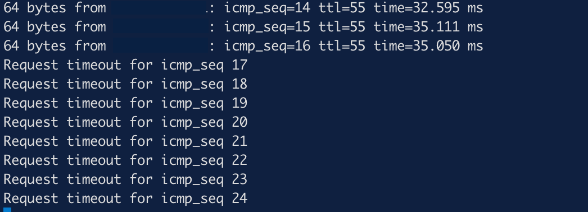

<!-- Improved compatibility of back to top link: See: https://github.com/othneildrew/Best-README-Template/pull/73 -->
<a id="readme-top"></a>
<!-- TABLE OF CONTENTS -->
<details>
  <summary>Table of Contents</summary>
  <ol>
    <li>
      <a href="#about-the-project">About The Project</a>
      <ul>
        <li><a href="#built-with">Built With</a></li>
      </ul>
    </li>
    <li>
      <a href="#getting-started">Getting Started</a>
      <ul>
        <li><a href="#prerequisites">Prerequisites</a></li>
        <li><a href="#installation">Installation</a></li>
      </ul>
    </li>
    <li><a href="#usage">Usage</a></li>
    <li><a href="#roadmap">Roadmap</a></li>
    <li><a href="#contributing">Contributing</a></li>
    <li><a href="#license">License</a></li>
    <li><a href="#contact">Contact</a></li>
    <li><a href="#acknowledgments">Acknowledgments</a></li>
  </ol>
</details>


<!-- ABOUT THE PROJECT -->
## About The Project

Sometimes the Eden demos are down, parts of them are broken, or we just want more control over the enviroment than we can get through Eden. This is a small collection of binaries and scripts to trigger Elastic Security detection rules. It simulates an ssh login, privilege escalation, malicious binary activity (without the _actual_ malicious activity), and data exfiltration, all of which will be captured by Elastic Defend.

<p align="right">(<a href="#readme-top">back to top</a>)</p>


<!-- GETTING STARTED -->
## Getting Started

To get a local copy up and running, just clone this repo into a directory on the host where you want to generate some security alerts (ideally, this should be a host running Elastic Agent with the Defend integration).

The project is structured like so:
```sh
├── bin                       # Contains the binaries that will trigger alerts from shared memory; will not be use directly
│   ├── move_along                     
│   └── nothing_to_see_here
├── files   
│   ├── demo_progs.tar        # The tar file that contains binaries in bin/ that will trigger alerts in /dev/shm/
│   └── eicar_com.zip         # Harmless eicar file that Defend will see as a malicious process
├── osquery                   # OSquery file(s) that can be used during alert investigation
│   └── osquery_find_deleted_processes
├── README.md
├── response                  # Files that can be executed from the Response Console to show response actions
│   └── response_file.sh
├── screenshots
│   ├── es-sec-demo_alerts_view.png
│   ├── es-sec-demo_attack_discovery.png
│   ├── es-sec-demo_building_blocks.png
│   ├── es-sec-demo_deleted_processes_running.png
│   ├── es-sec-demo_event_analyzer.png
│   ├── es-sec-demo_isolate_host.png
│   ├── es-sec-demo_release_host.png
│   └── es-sec-demo_remove_command.png
├── scripts             # The heart of the demo environment
│   ├── config.sh       # Contains variables used by these scripts
│   ├── demo_start.sh   # Script (run from local machine) that kicks off all the "malicious" activity by calling exfill.sh
│   └── exfill.sh       # Does all the "malicious" dirty work
└── src                 # Source files for the binaries in case you want to modify them to your liking (just remember to re-compile)
    ├── move_along.c
    └── nothing_to_see_here.c
```

### Prerequisites

This repo contains everything you need for it to just _work_, including the binaries that will be used to trigger some alerts. That said, the C code for those binaries is also included in the event you want to compile them for yourself (e.g. you don't trust me, you need to run them on an architecture other than x86, etc). If you do want to compile them yourself, you'll need a compiler like GCC.


### Installation

I've tried to make it as painless as possible, but there are still a few manual steps that need to be taken to get this repo operational.

1. Clone the repo
   ```sh
   git clone https://github.com/eric-cobb/es-security-demo.git
   ```
2. Install gcc compiler, if desired
   ```sh
   yum install gcc
   ```
3. The main `exfill.sh` script sources variables from `scripts/config.sh`. In the `scripts/config.sh` script, modify the following values to mirror your environment:
   ```sh
   ROOTDIR=''        # Base directory from which all of these alert triggers will be run on the target host
   HOMEDIR=''        # This is the base directory from which all of these alert triggers will be run
   EXFILL_TARGET=''  # This is where the scp command will attempt to "exfill" the data; in my environment I have another EC2 instance that I attempt to copy to
   FILE='/dev/shm/totally_not_exfill.tar.gz' # The file that will be "exfilled"
   ```
4. Copy/move the `scripts/demo_start.sh` script to your local machine. This is the script that will kick off the whole shebang by ssh-ing into the host where the triggers in this repo live (ideally on a separate EC2 instance, container, whatever where Elastic Agent is running with Defend)
5. Modify the demo_start.sh script to update three values:
   ```sh
   TARGET_HOST='' # The hostname or IP of the host to which this script will attempt to login and start triggering alerts. This should be the same host as where this repo was cloned (i.e. where all the scripts and binaries live).
   ROOTDIR=''     # Base directory from which all of these alert triggers will be run on the target host
   SSH_USER=''    # This should be the user you have set up to ssh from your local machine (where this demo_kickoff.sh script will be run from) to the TARGET_HOST
   ```
   Of course, you'll need ssh keys configured on both your local machine and the TARGET_HOST machine in order for all of this to work.
6. Within Elastic Security, you'll need an Agent Policy assigned to an Agent running on the TARGET_HOST machine running the following integrations:

   * Defend
   * Auditd Manager
   * OSquery Manager
   * System
   * Threat Intelligence (optional)
   
   You'll also need the following Detection Rules enabled:
   
   * Endpoint Security (Elastic Defend)
   * Potential Data Exfiltration Through Curl
   * Linux Restricted Shell Breakout via Linux Binary(s)
   * Account or Group Discovery via Built-In Tools
   * Linux System Information Discovery
   * DLR PPC Indicator Match
   * Binary Executed from Shared Memory Directory
   * Threat Intel URL Indicator Match (optional)

<p align="right">(<a href="#readme-top">back to top</a>)</p>


<!-- USAGE EXAMPLES -->
## Usage

NOTE: The binaries (`bin/nothing_to_see_here` and `bin/move_along`) are written to run with default values and arguments, but those can be changed to fit your environment. For usage examples, run:

   nothing_to_see_here
   ```sh
   [user@host bin]$ ./nothing_to_see_here -h
   Usage:
   ./nothing_to_see_here [program-to-run] [args...]
   ./nothing_to_see_here [flags-for-default]

   Behavior:
   • If the first argument starts with '-', arguments are passed to the default program:
         ./nothing_to_see_here -s 60 -c "/bin/echo hi"  -> runs /dev/shm/move_along with those flags
   • If the first argument does not start with '-', it is treated as the program to run:
         ./nothing_to_see_here /usr/bin/echo hello        -> runs /usr/bin/echo hello
   • If no arguments are given, runs the default program with no args.

   Options:
   -h, --help   Show this help (for the launcher)
   ```

   move_along
   ```sh
   [user@host bin]$ ./move_along -h
   usage: ./move_along [-s seconds] [-c "command"]

   Runs a shell command (default is a tar invocation) and then sleeps.

   Options:
   -s seconds   Sleep duration after the command (default: 10800)
   -c command   Shell command to execute (default:
                  "/usr/bin/tar czPf totally_not_exfill.tar.gz /etc/passwd")
   -h           Show this help and exit

   Examples:
   ./move_along                      # uses default tar command, then sleeps 3h
   ./move_along -s 300               # default command, sleep 5 min
   ./move_along -c "/usr/bin/echo hi"  # custom command, default sleep
   ```

Once everything is in place on the TARGET_HOST and the `demo_start.sh` script is in place on your local machine, the only thing you need to do now (and in the future) for this demo is run the `demo_start.sh` script:
   
   ```sh
   sh demo_start.sh
   ```
This will attempt to ssh into the TARGET_HOST, run some commands, and do some things that trigger alerts. On your local machine you'll see some short output while these actions are taking place, followed by a ping to the TARGET_HOST:
   ```sh
   Generating some random noise for the Event Analyzer view
   Copying C programs over and executing
   Triggering Indicator Match Detection Rules
   Triggering Malware alert with EICAR file
   Triggering Linux system info discovery rule
   Removing files from /dev/shm
   PING xxx.xxx.xxx.xxx (xxx.xxx.xxx.xxx): 56 data bytes
   64 bytes from xxx.xxx.xxx.xxx: icmp_seq=0 ttl=55 time=32.529 ms
   64 bytes from xxx.xxx.xxx.xxx: icmp_seq=1 ttl=55 time=31.183 ms
   64 bytes from xxx.xxx.xxx.xxx: icmp_seq=2 ttl=55 time=33.252 ms
   ```
Leave this ping running! You'll want it to show host isolation later.

You may need to manually run these two detection rules, as they run once an hour and may not run on their normal schedule before time to give the demo:

* Account or Group Discovery via Built-In Tools
* Linux System Information Discovery

Now you're ready to start investigating alerts (well, once your detection rules have all run)! Navigate to the Alerts page and you should see quite a few alerts that have been triggered:


Ensure that building block alerts are selected in "Additional filters":


Now you can talk through whatever normal flow you like when demoing Security, but when you get ready to investigate an alert, here is a demo flow that I tend to use. I think it shows well:

1. Select the Linux Restricted Shell Breakout via Linux Binary(s) alert and talk through some of the alert details.
2. Bring up the Event Analyzer. The binaries used in this repo generated some user/filessytem activity through a specific process ancestry:


Be sure to also go all the way to the end of the process ancestry (all the way at the top right) and talk about the 'rm' command being run, and how it looks like someone may have tried to cover their tracks by removing the binary from disk (this will set up an OSquery investigation later).


3. Talk about Cases, Session View or whatever else you feel is necessary here, then move to taking some kind of action. Now would be a good time to isolate the host and bring up the terminal window on your local machine showing the running ping to the TARGET_HOST:



4. Now you can pull up OSquery and run the query in osquery/osquery_find_deleted_processes:

   ```sql
   SELECT pid, name, path, cmdline, on_disk 
   FROM processes 
   WHERE on_disk = 0;
   ```
   _NOTE: You can save this query as a saved query in OSquery Manager so that it's always available without having to copy-pasta._

This will find running processes that have been deleted from disk but are still running in memory:


5. From here, the world is really your oyster. There are response action scripts in response/ that you can use to show executing scripts while the host is still isolated. This repo also creates enough noise and enough activity to have a decent showing with Attack Discovery, so be sure to go that route, too:


<!-- FINAL THOUGHTS -->
## Final Thoughts
This is something I've been using for a few years now and it always seems to show well, so I wanted to share this with anyone who might get some value from it. Sometimes it's nice to have an environment that you control, rather than a canned demo environment that you don't have the permissions to show things when the customer asks questions outside of the demo flow. I hope you find value in it too, and please feel free to contribute...there's plenty of room for improvement and enhancement here!
